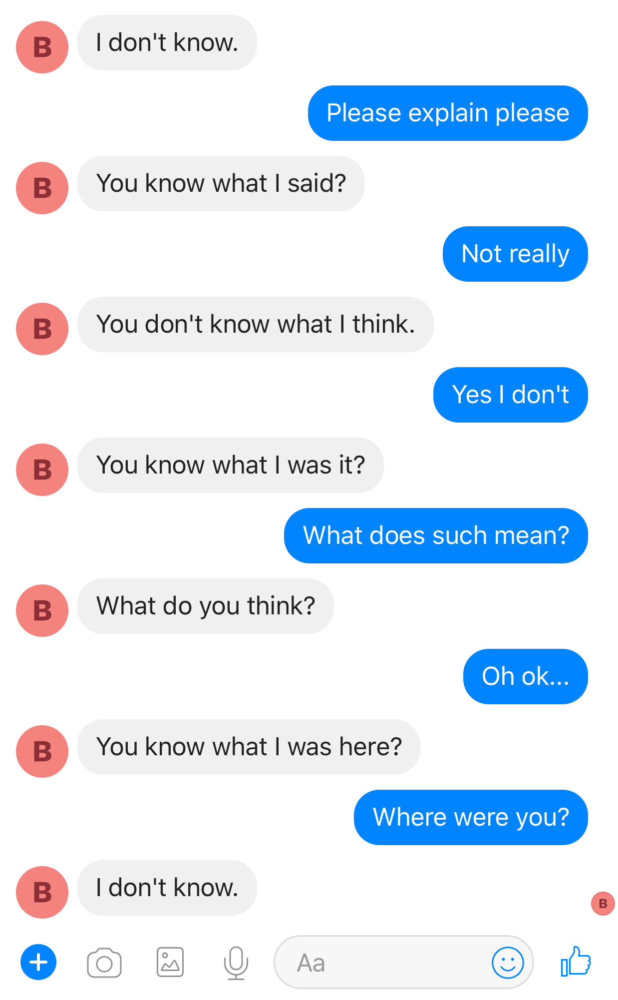

# Brobot Facebook Messenger Chat bot
* Conversational bot using Tensorflow seq2seq deep learning model
* It runs on a Flask server as a Heroku app using Facebook Messenger Platform
* Currently trained on Cornell Movie Dialog corpus (movie conversations dataset)
* Here's an example of it at work (kind of)!

## Possible improvements:
* Improve seq2seq model (attention, multi-RNN, bidirectional)
* Allow understanding of emojis :smiley:
* Train on more chat datasets :smiley:
